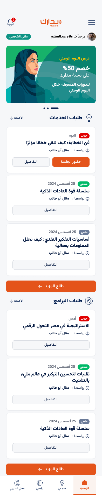
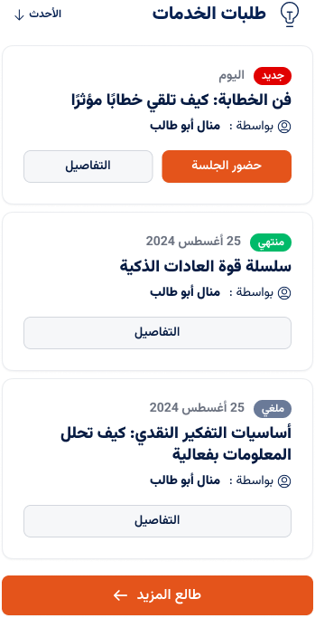

# Design API - Home Screen

## Overview

The Home screen serves as the main dashboard for the app, providing quick access to notifications, profile details, promotional banners, event listings, and navigation tabs.



---

## Components

### 1. Header

- **Notification**
  - **Endpoint**: `/api/user/notifications`
- **Method**: `GET`
- **Description**: Retrieves the user's notifications with notifications    count

  - **Data Fields**:
    - `notifications_count` (Integer): Number of unread notifications
  


- **Profile Info**
  - **Data Fields**:
    - `username` (String): it will get from Login `Login end point` and cached locally on user Device
    - `profile_image_url` (String): it will get from Login `Login end point` and cached locally on user Device

### 2. Slider


- **Endpoint**: `/api/sliders`
- **Method**: `GET`
- **Description**: Fetches all slider images.

#### Example JSON for Sliders

```json
{
  "sliders": [
    {
      "id": 1,
      "image_url": "https://example.com/assets/slider1.jpg",
      "title": "خصم 30% على جميع الدورات",
      "description": "استفد من العرض قبل انتهاء الشهر",
      "action_url": "https://example.com/offers"
    },
    {
      "id": 2,
      "image_url": "https://example.com/assets/slider2.jpg",
      "title": "الدورة المجانية",
      "description": "سجل الآن واحصل على أول دورة مجانية",
      "action_url": "https://example.com/free-course"
    },
    {
      "id": 3,
      "image_url": "https://example.com/assets/slider3.jpg",
      "title": "أحدث البرامج التدريبية",
      "description": "تابع برامجنا الجديدة في المجالات التقنية",
      "action_url": "https://example.com/new-programs"
    }
  ]
}
```
### 3. Events List
 
  - **Endpoint**: `/api/events?page_size&page_number`
- **Method**: `GET`
- **Description**: Fetches a pagination list of events, including each event's title, date, status, and author  


#### Example JSON

```json
{
  "events": [
    {
      "title": "فن الخطابة: كيف تلقي خطاباً مؤثراً",
      "date": "ISO format /UTC / As you want",
      "status": "new/expired/cancelled",
      "author": "منال أبو طالب"
    },
    {
      "title": "سلسلة قوة العادات الذكية",
      "date": "25 أغسطس 2024",
      "status": "منتهي",
      "author": "منال أبو طالب"
    }
  ],
  "totalPages": 1,
  "last": true
}
```


